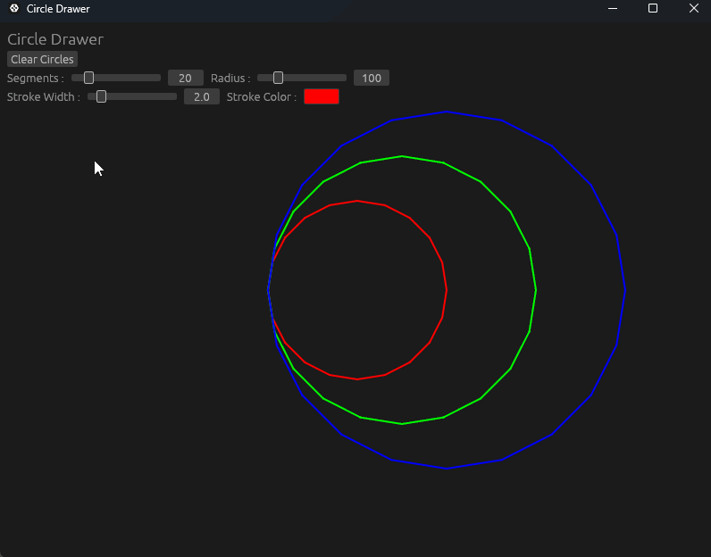
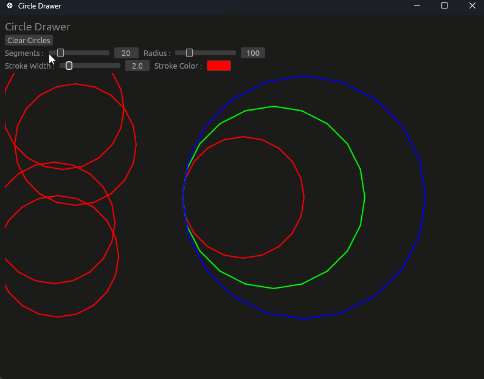

# Circle Drawer

Simple Circle Drawer with egui in Rust
 

-Draw Circles with left click 
-Use sine & cosine to create the circle points 

Circles Options : 
-Radius (Change with mousewheel) 
-Segments 

Stroke Options : 
-Width 
-Color 

## Images

